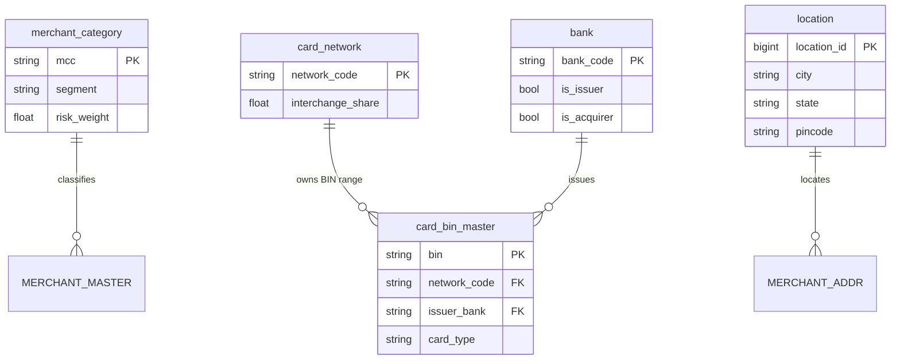
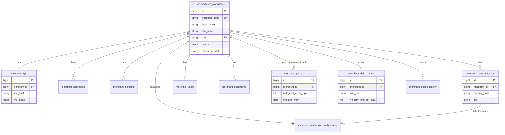
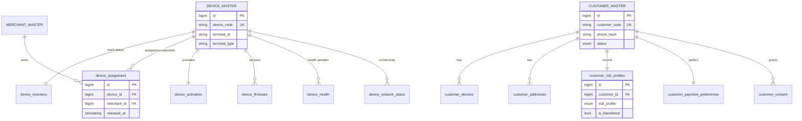
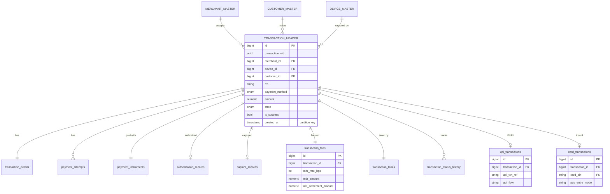
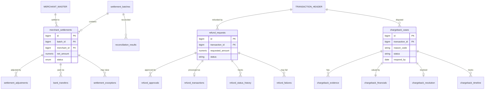
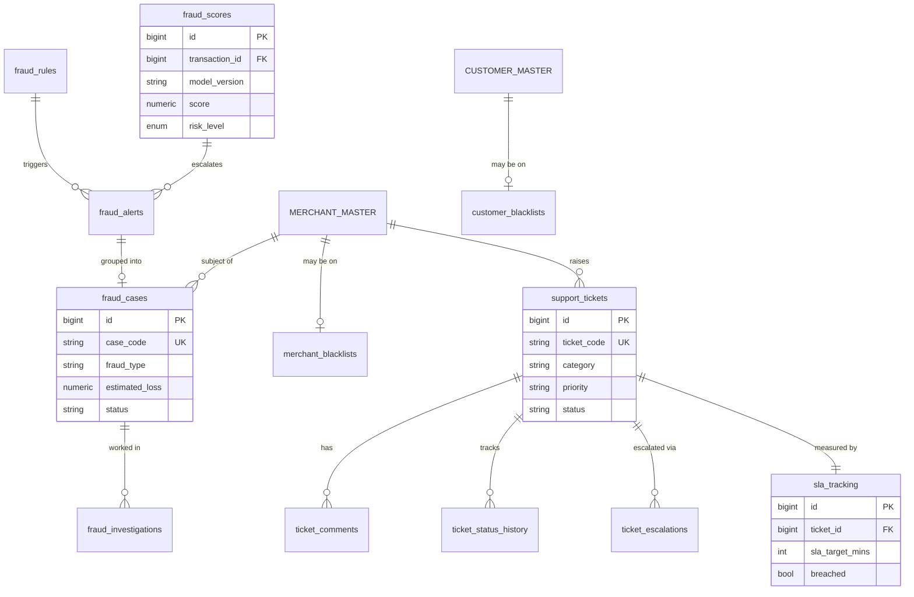
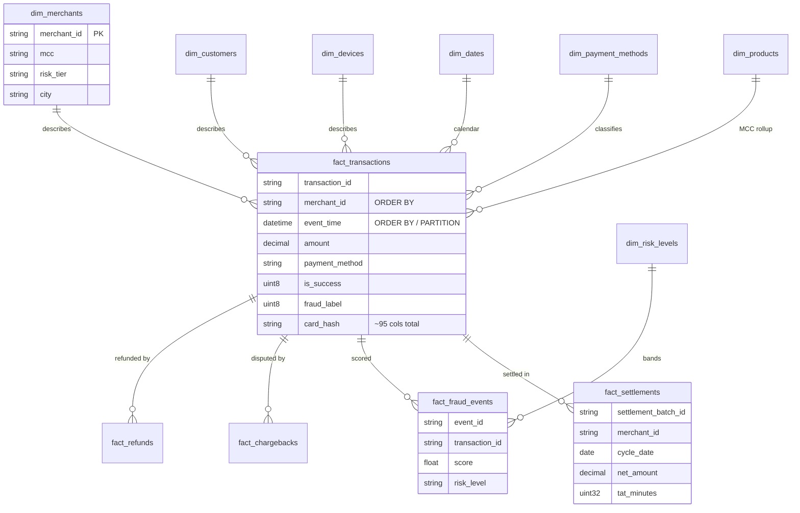

# Entity Relationship Diagram (ERD)

> The OLTP model is ~80 tables across 10 schemas — too dense for one diagram, so
> it's split by domain (the standard approach for a large normalized schema).
> Each diagram shows the hub table, its key satellites, and cross-domain links.
> The ClickHouse star schema follows at the end. Full columns are in
> [`../postgres/ddl/`](../postgres/ddl) and the data dictionary.

Legend: `PK` primary key · `FK` foreign key · `UK` unique key.

---

## 1. Reference / master data (`ref`)

---

## 2. Merchant domain

---

## 3. Device & Customer domains

---

## 4. Transaction domain (hub of the platform)

---

## 5. Settlement / Refund / Chargeback domains

---

## 6. Fraud & Support domains

---

## 7. ClickHouse star schema (OLAP)

The analytical model denormalizes the OLTP entities into wide fact tables
surrounded by conformed dimensions. Facts share `merchant_id` / `event_time`
grain; MVs roll them up.

**MV rollups (not entities, but derived tables):** `agg_merchant_daily/hourly/
monthly`, `agg_velocity_5m`, `agg_fraud_features`, `agg_settlement_perf`,
`agg_device_health`, `agg_revenue_daily` — each fed by a `mv_*` and read via a
finalized `v_*` view.
