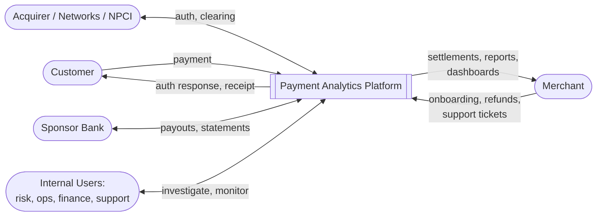
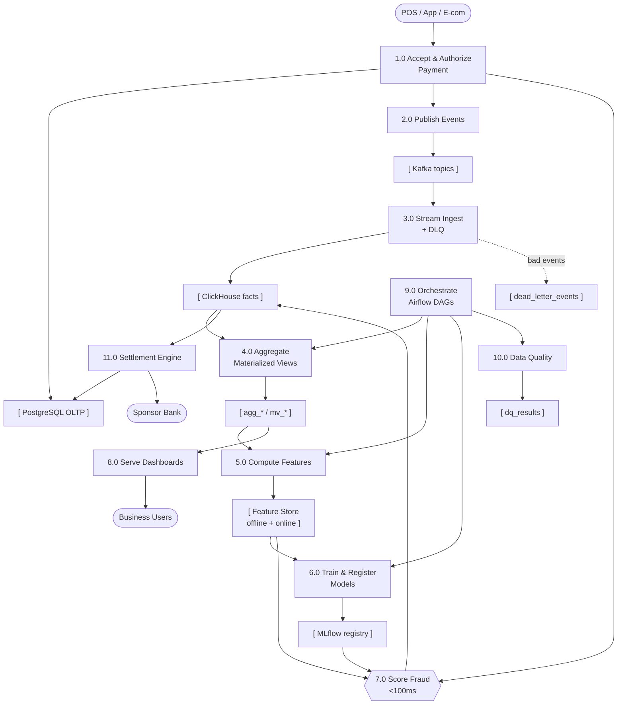
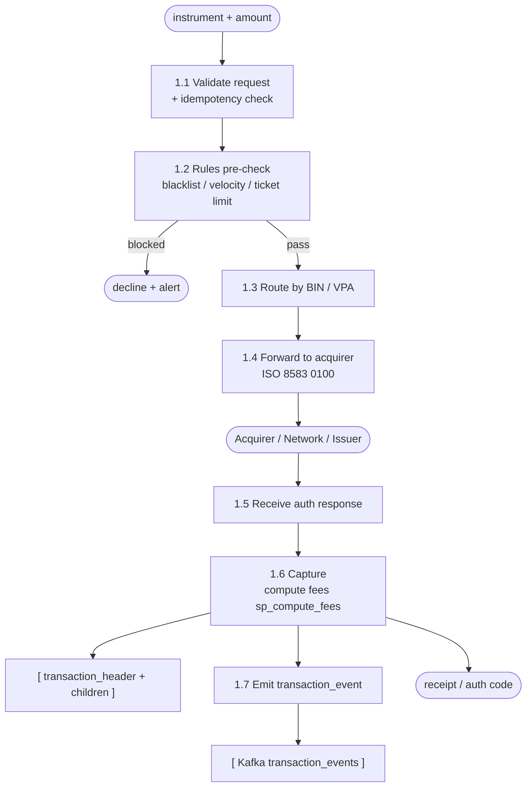
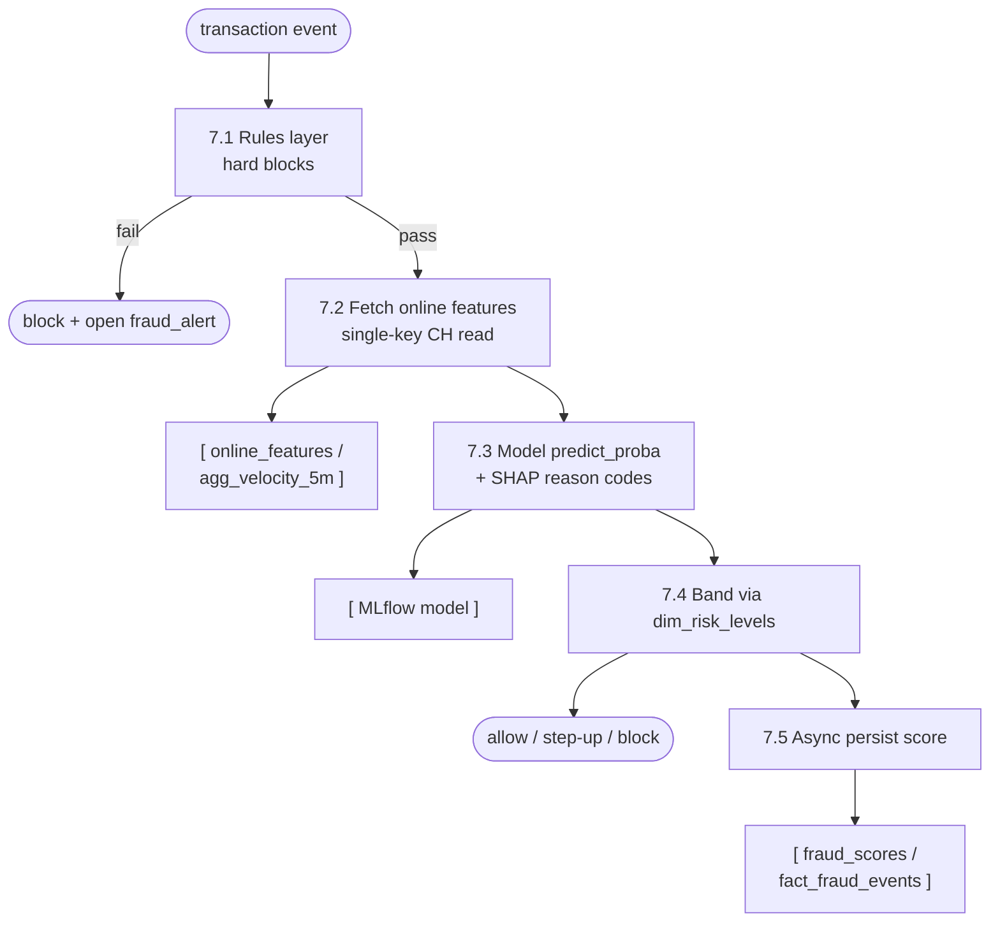

# Data Flow Diagrams (DFD)

> Classic structured-analysis DFDs: Level 0 (context), Level 1 (major
> processes + data stores), and Level 2 detail for the two hardest flows
> (transaction processing, fraud scoring). External entities are rounded;
> processes are numbered; data stores are `[ ]`.

---

## Level 0 — Context diagram

The platform as a single process and who/what it exchanges data with.

---

## Level 1 — Major processes and data stores

**Data stores**

| ID | Store | Engine |
|---|---|---|
| D1 | PostgreSQL OLTP | system of record |
| D2 | Kafka topics | event log |
| D3 | ClickHouse facts | OLAP |
| D4 | MV aggregates | OLAP derived |
| D5 | Feature store | offline + online |
| D6 | MLflow registry | model artifacts |
| D7 | Dead-letter events | quarantine |
| D8 | DQ results | scorecard |

---

## Level 2 — Process 1.0: Accept & Authorize Payment

Key data written: `transaction_header` (state machine), `authorization_records`,
`capture_records`, `transaction_fees`, `transaction_taxes`, then the published
`TransactionEvent`.

---

## Level 2 — Process 7.0: Score Fraud (< 100 ms)

The synchronous path is 7.1 → 7.4 (returns the decision); 7.5 is fire-and-forget
so the write never counts against the latency budget. Confirmed outcomes (and
later chargebacks) loop back as labels into Process 6.0.

---

## Notes on flow semantics

- **Solid arrows** = synchronous request/response or in-line data write.
- **Dashed arrows** = async / error / feedback paths.
- The **hot path** (1.0 → 7.0) never depends on Airflow (9.0) or the MV layer
  being current — it reads pre-computed online features, so analytics lag never
  affects authorization.
- The **analytical path** (2.0 → 3.0 → 4.0 → 8.0) is eventually consistent with
  OLTP, lagging by seconds under normal stream load.
