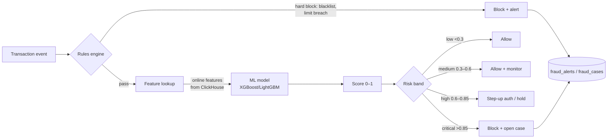
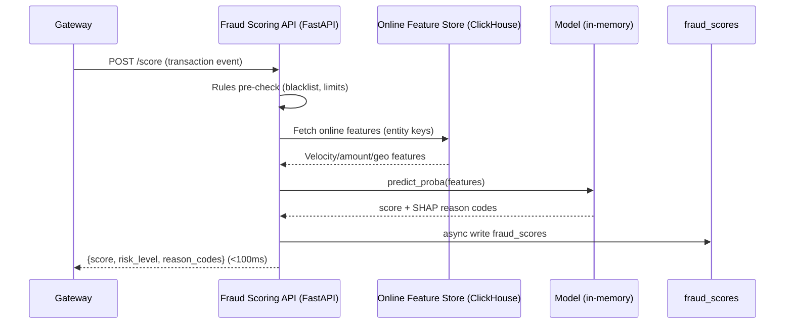
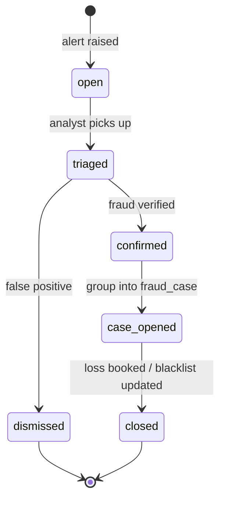

# Fraud Flow

> Fraud detection is the platform's hardest real-time problem: score every
> transaction in **< 100ms**, catch the genuine attacks, and don't strangle good
> customers with false positives. This document covers the fraud taxonomy we
> model, the two-layer detection pipeline (rules + ML), case management, and the
> chargeback tie-in.

---

## 1. Fraud taxonomy

These are the scenarios the data generator injects (`fraud_scenario`) and the
models are trained to catch. Each has a distinct signature in the features.

| Scenario | What it looks like | Tell-tale features |
|---|---|---|
| **Card testing** | Bot runs many tiny auths against stolen card numbers to find live ones. | High count, tiny amounts, **high decline ratio**, many BINs on one device |
| **Velocity fraud** | Rapid burst of transactions on one card/device before the card is blocked. | `txn_count_5m` spike, single entity, normal amounts |
| **Device takeover** | A known-good device suddenly transacts from a far-away geo. | Geo jump vs device history, amount inflation |
| **Geographic anomaly** | Customer transacts >1000 km from home within an hour ("impossible travel"). | `geo_velocity` km/h impossibly high |
| **Merchant collusion** | Merchant runs inflated/fake tickets at odd hours to launder or cash out. | Odd-hour spikes, ticket >> merchant's avg, self-churning |
| **Refund abuse** | Purchase immediately followed by refund to a different instrument. | Fast purchase→refund, `is_abusive` refunds |
| **Chargeback abuse** | "Friendly fraud" — customer disputes a legitimate purchase. | High chargeback ratio for a customer/merchant |

---

## 2. Two-layer detection pipeline



**Layer 1 — Rules** (`fraud.fraud_rules`): deterministic, instant, explainable.
Hard checks the business and regulator demand: blacklists
(`merchant/device/customer_blacklists`), per-merchant velocity and ticket
limits, sanctioned geographies. Each rule has a `severity` and an `action`
(`flag` / `hold` / `block` / `step_up`).

**Layer 2 — ML score** (`fraud.fraud_scores`): a gradient-boosted model returns
a calibrated probability plus **reason codes**. Risk bands come from
`payments.dim_risk_levels`. This is the layer the real-time API serves.

---

## 3. Features (the heart of it)

Features are computed in ClickHouse and served two ways (see the feature-store
docs): **offline** for training (point-in-time correct) and **online** for
scoring (latest value, sub-ms read).

| Family | Examples | Source |
|---|---|---|
| **Velocity** | txn count 5m / 1h / 24h per card & device | `agg_velocity_5m` |
| **Amount** | avg, max, ratio-to-merchant-avg, z-score | `agg_fraud_features` |
| **Decline** | decline count & ratio (card-testing signal) | `agg_fraud_features` |
| **Geo** | distance from last txn, implied speed | `fact_transactions` lat/lon |
| **Merchant** | merchant fraud rate, chargeback ratio, MCC risk | `mv_fraud_features` |
| **Device** | unique cards per device, fingerprint reuse | `agg_velocity_5m` (device) |
| **Entity reputation** | customer/merchant lifetime risk | dim risk profiles |

---

## 4. Real-time scoring sequence



The score write-back to ClickHouse is **async** so it never adds to the
sub-100ms response budget.

---

## 5. Case management

When a score is `high`/`critical` or a rule fires, the system raises a
`fraud.fraud_alerts` row. Analysts triage alerts; confirmed patterns are grouped
into a `fraud.fraud_cases` (with `estimated_loss`), worked in
`fraud.fraud_investigations`, and the finding (`confirmed_fraud` /
`false_positive` / `inconclusive`) feeds back as a **label** to retrain the model.



Confirmed fraud also drives **blacklist** inserts and may force a merchant to
`suspended` (see [merchant_lifecycle.md](merchant_lifecycle.md)).

---

## 6. Fraud ↔ chargeback relationship

Fraud and chargebacks are two views of the same loss. A missed fraud often
surfaces weeks later as a chargeback (`chargeback.chargeback_cases` with
`reason_category = 'fraud'`). The chargeback's eventual outcome is a **delayed,
high-quality label** for the fraud model. The feedback loop:

```
transaction → (missed) → chargeback (reason=fraud) → label → retrain → catch next time
```

---

## 7. Metrics (Risk & Fraud dashboard)

| Metric | Definition |
|---|---|
| **Fraud rate** | confirmed-fraud txns / total txns (bps) |
| **Detection rate (recall)** | caught fraud / total fraud |
| **False-positive rate** | good txns flagged / good txns |
| **Precision** | true fraud / all flagged |
| **Fraud loss** | Σ `estimated_loss` of confirmed cases |
| **Detection latency** | event time → alert time |
| **Recovery rate** | recovered / lost |

Model quality (Precision, Recall, F1, ROC-AUC, PR-AUC) is tracked per model
version in **MLflow**; live distribution and **SHAP** feature attributions are
shown on the dashboard so analysts can see *why* a transaction scored high.
