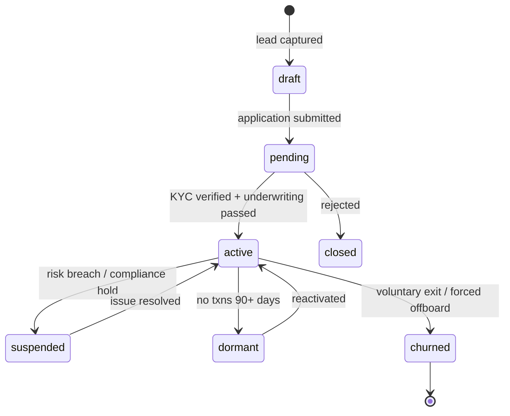
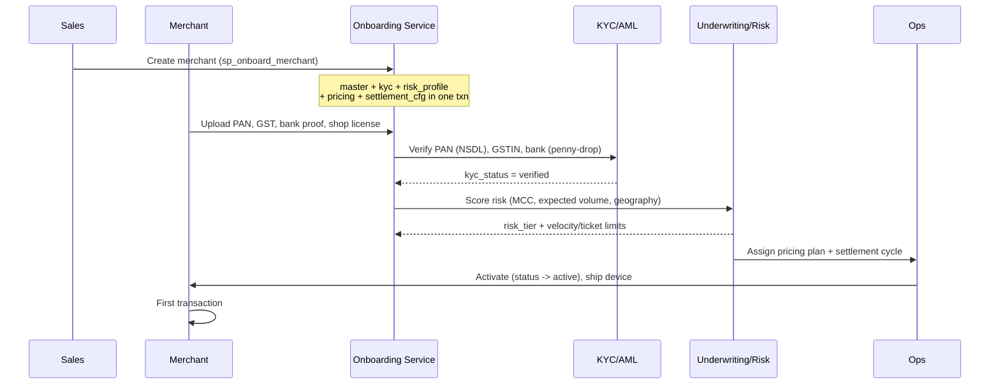
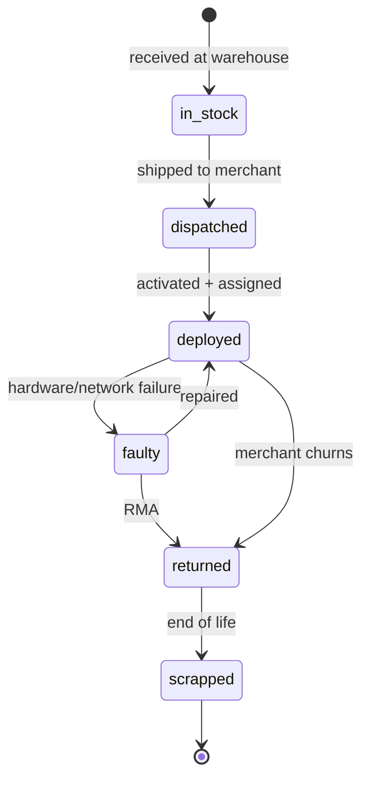

# Merchant Lifecycle

> A merchant is the platform's revenue-bearing customer. Everything — pricing,
> risk, devices, settlements, support — keys off the merchant record. This
> document covers onboarding through churn, and the POS device lifecycle that
> rides alongside it.

---

## 1. Lifecycle stages

The `merchant.merchant_master.status` column (enum `ref.lifecycle_status`)
tracks where a merchant is. Transitions are written to
`merchant.merchant_status_history` automatically by `trg_merchant_status`.



| Stage | Meaning | Can transact? |
|---|---|---|
| `draft` | Lead in CRM, no application yet. | No |
| `pending` | Application + documents submitted, under review. | No |
| `active` | Live and accepting payments. | Yes |
| `suspended` | Temporarily blocked (risk, dispute spike, compliance). | No |
| `dormant` | Inactive 90+ days; kept warm for reactivation. | Limited |
| `churned` | Off the platform. | No |
| `closed` | Application rejected before activation. | No |

---

## 2. Onboarding workflow



`merchant.sp_onboard_merchant()` does the multi-table insert atomically:
`merchant_master` + `merchant_kyc` + `merchant_risk_profiles` +
`merchant_pricing` + `merchant_settlement_configuration`. This guarantees no
half-onboarded merchant exists.

### KYC artifacts (`merchant.merchant_kyc` + `merchant_documents`)

| Document | Verified against | Stored as |
|---|---|---|
| PAN | NSDL / Income Tax | `pan_hash` (SHA-256, never raw) |
| GSTIN | GST portal | `gstin_masked` |
| Bank account | Penny-drop (₹1 credit + name match) | `merchant_bank_accounts.penny_drop_verified` |
| Aadhaar (proprietor) | UIDAI eKYC | `aadhaar_hash` |
| CIN (companies) | MCA | `cin` |

> **PII rule:** the OLTP store never holds raw PAN/Aadhaar/account numbers —
> only salted hashes and masked values. Document blobs live in object storage;
> `merchant_documents.storage_key` is just a pointer.

---

## 3. Merchant Category Code (MCC) and segment

Every merchant has an MCC (`merchant_master.mcc` → `ref.merchant_category`). MCC
drives three things: **interchange/MDR**, **risk weighting**, and **analytics
segmentation**. The platform's segments:

| Segment | Example MCC | Avg ticket | Risk |
|---|---|---|---|
| Grocery | 5411 | ₹850 | Low |
| Restaurant | 5812 | ₹650 | Low |
| Pharmacy | 5912 | ₹450 | Low |
| Fuel | 5541 | ₹1,500 | Low |
| Retail | 5999 | ₹1,100 | Low–Med |
| Electronics | 5732 | ₹12,000 | Med |
| Hospital | 8062 | ₹4,200 | Low |
| E-commerce | 5969 | ₹1,800 | **High** (CNP fraud) |

---

## 4. Pricing (MDR) and risk profile

**Pricing** (`merchant.merchant_pricing`) is time-versioned per merchant with a
GiST exclusion constraint that forbids overlapping `[effective_from, effective_to)`
windows — so there is always exactly one active price book. Rates are stored in
basis points per method:

```
mdr_card_credit_bps   default 180   (1.80%)
mdr_card_debit_bps    default  40   (0.40%, regulator-capped)
mdr_upi_bps           default   0   (zero-MDR regime)
mdr_wallet_bps        default 150
mdr_emi_bps           default 220
```

**Risk** (`merchant.merchant_risk_profiles`) sets the guard-rails the switch
enforces in real time:

- `risk_tier` (low/medium/high/critical) — feeds fraud rule severity.
- `velocity_limit_per_day` — max transactions/day before auto-hold.
- `max_ticket_amount` — single-transaction ceiling.
- `chargeback_threshold_bps` — if chargeback ratio exceeds this, auto-suspend.

---

## 5. POS device lifecycle

A merchant's terminals have their own lifecycle in the `device` schema, loosely
coupled to the merchant via `device.device_assignment` (a device can move between
merchants over time; a partial unique index enforces **one live assignment at a
time**).



| Concern | Table |
|---|---|
| Hardware identity (serial, terminal id, model) | `device.device_master` |
| Stock status | `device.device_inventory` |
| Merchant binding | `device.device_assignment` |
| Activation / TMS profile | `device.device_activation` |
| Firmware/app version pushes | `device.device_firmware` |
| Battery, heartbeat, health score | `device.device_health` |
| Connectivity (4G/wifi, signal) | `device.device_network_status` |
| GPS | `device.device_location` |
| Repairs (RMA) | `device.device_repair_history` |

Device health and failures flow to ClickHouse as `fact_device_events`, rolled up
by `mv_device_health` into a daily per-device summary the Operations dashboard reads.

---

## 6. Audit and compliance

Every mutation to `merchant_master` and `device_master` is captured as a JSONB
diff in `merchant.merchant_audit_log` / `device.device_audit_log` by the shared
`ref.audit_row()` trigger. This gives a tamper-evident history for disputes,
regulator queries, and internal investigations — a hard requirement for a
regulated payments entity.

---

## 7. Analytics view

Merchant growth, retention, device utilization, RFM and lifetime value are
computed in ClickHouse from `fact_merchant_events` (lifecycle changes) and the
`mv_merchant_daily` / `mv_merchant_monthly` rollups, surfaced on the **Merchant
Insights** dashboard. Cohorts are anchored on `onboarded_date`; churn is derived
from the `dormant → churned` transition timestamps in `merchant_status_history`.
