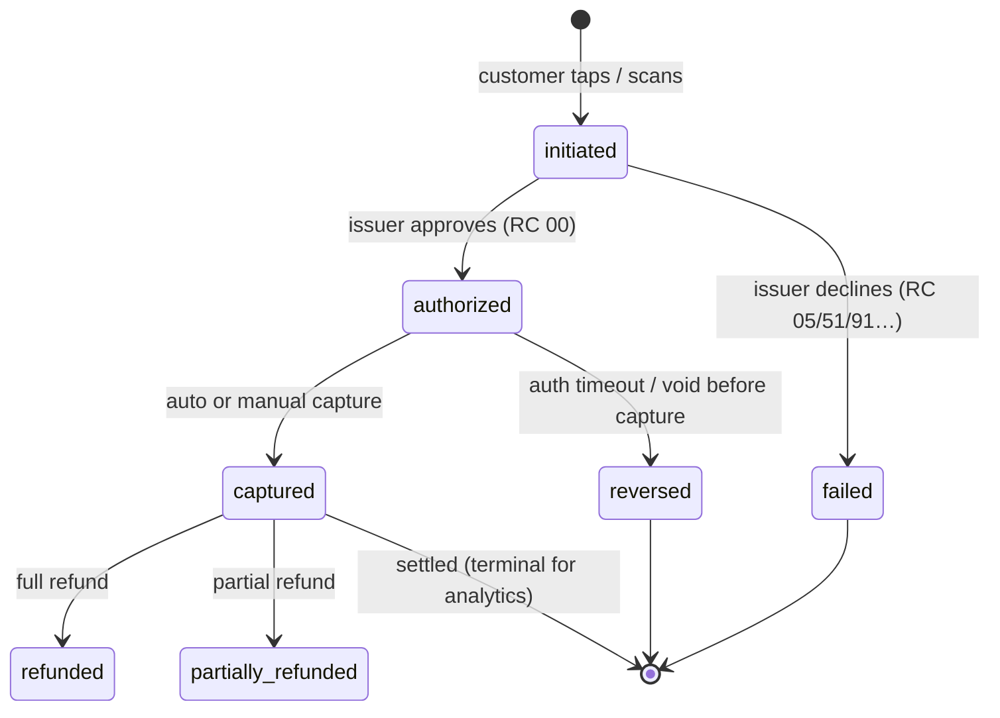
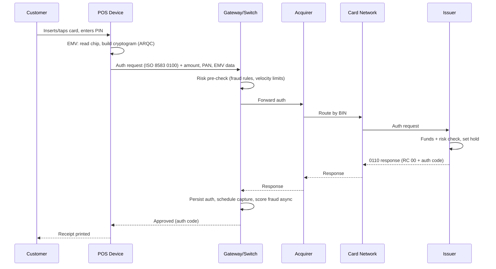
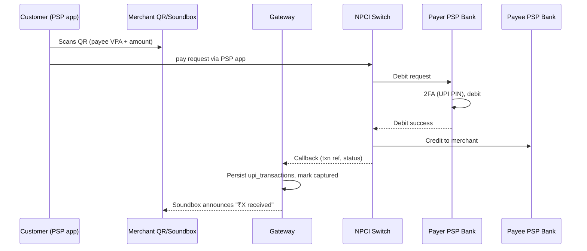

# Payment Lifecycle

> How a single payment moves through the platform, from a tap on a POS terminal
> to money in the merchant's bank account. This is the spine the whole system
> hangs off — every other lifecycle (settlement, refund, chargeback, fraud)
> branches from a transaction in one of the states below.

---

## 1. Actors and systems

| Actor | Role |
|---|---|
| **Customer** | Pays with UPI / card / wallet at a merchant. |
| **Merchant** | Accepts the payment via a POS device, QR, or online checkout. |
| **POS device / app** | Captures the instrument, builds the request, talks to the gateway. |
| **Payment gateway / switch** | Our system. Routes, authorizes, captures, records. (`txn` schema) |
| **Acquiring bank** | Holds the merchant's settlement relationship; sponsors us into the networks. |
| **Card network** | Visa / Mastercard / RuPay / Amex — routes auth between acquirer and issuer. |
| **Issuing bank** | The customer's bank; approves or declines and debits the customer. |
| **NPCI** | Runs UPI and RuPay rails; the switch for UPI `collect`/`pay` and RuPay auth. |

For the data model these map to `txn.transaction_header` (the spine) plus the
instrument-specific children `txn.card_transactions` / `txn.upi_transactions`,
and the authorization/capture/fee satellite tables.

---

## 2. The four payment rails we process

| Rail | Flow | Key fields | Settlement |
|---|---|---|---|
| **UPI** | Real-time A2A via NPCI. `intent` (scan QR / tap), `collect` (request-to-pay), `autopay` (mandate). | `payer_vpa`, `payee_vpa`, `upi_txn_ref`, `npci_response` | T+1, **zero MDR** (RBI regime) |
| **Debit/Credit card** | ISO 8583 auth → capture. Card-present (EMV chip/contactless) or card-not-present (e-com + 3DS). | `card_bin`, `card_network`, `auth_code`, `rrn`, `stan` | T+1/T+2, MDR applies |
| **Wallet** | Prefunded balance (Paytm/Mobikwik/Amazon Pay) debited via the wallet PSP. | `wallet_provider` | T+1, MDR applies |
| **EMI** | Credit-card transaction converted to instalments by the issuer. | `is_emi`, `emi_tenure_months` | T+2, higher MDR |

---

## 3. Transaction state machine

The canonical states live in the `ref.txn_state` enum and are enforced on
`txn.transaction_header.state`. Every transition is appended to
`txn.transaction_status_history` by the `trg_txn_state` trigger.



| State | Meaning | Typical dwell time |
|---|---|---|
| `initiated` | Request built, sent to switch. | ms |
| `authorized` | Issuer put a hold on funds. Auth code issued. | ms–seconds |
| `captured` | We've claimed the funds; enters the settlement queue. | seconds (auto-capture is default) |
| `failed` | Declined or errored. Carries a `response_code`. | terminal |
| `reversed` | Auth voided before capture (timeout, customer cancel). | terminal |
| `refunded` / `partially_refunded` | Money returned post-capture (see refund flow). | days |

**Card-present vs auto-capture.** Most POS flows are auth+capture in one shot
(`capture_mode = 'auto'`). Hotels/rentals use delayed capture (auth now, capture
at checkout), which is why authorization and capture are modeled as separate
tables (`txn.authorization_records`, `txn.capture_records`).

---

## 4. Authorization sequence (card-present, EMV)



Target end-to-end latency is **< 3s** at the terminal; our switch's own overhead
(the `GW` boxes) targets **< 100ms**, so the issuer round-trip dominates. We
record `auth_latency_ms` to monitor issuer health per bank.

---

## 5. UPI sequence (intent / scan-and-pay)



UPI is **push-based and irrevocable on success** — there is no separate capture,
and "refunds" are fresh reverse transactions, not voids. This is why
`upi_collect_requests` carries an `expires_at` and a `pending/paid/expired`
status: a collect can sit unpaid, unlike a card auth.

---

## 6. Response codes (decline taxonomy)

We normalize issuer/NPCI codes into `response_code` and derive `is_success`. The
decline mix drives the fraud signal `decline_count` and the ops "approval rate" KPI.

| Code | Meaning | Success | Notes |
|---|---|---|---|
| `00` | Approved | ✅ | ~91–95% of volume |
| `05` | Do not honor | ❌ | Generic issuer decline; spikes in **card testing** |
| `51` | Insufficient funds | ❌ | |
| `91` | Issuer unavailable | ❌ | Issuer downtime — retryable |
| `54` | Expired card | ❌ | |
| `61` | Exceeds withdrawal limit | ❌ | |
| `U69` | UPI collect expired | ❌ | UPI-specific |
| `U30` | UPI debit failed | ❌ | UPI-specific |

---

## 7. Fees computed at capture

When a transaction is captured, `txn.sp_compute_fees()` resolves the merchant's
active pricing row and writes `txn.transaction_fees` + `txn.transaction_taxes`:

```
mdr_amount            = amount × mdr_rate_bps / 10,000
interchange_fee       ≈ 70% of MDR (paid to issuer via network)
network_fee           ≈ 10% of MDR (paid to the network)
gst_on_fees           = 18% × MDR            (Indian GST on the fee, not the txn)
net_settlement_amount = amount − MDR − GST    (what the merchant receives)
```

- **UPI MDR is 0 bps** under the current RBI zero-MDR mandate for UPI/RuPay debit.
- Credit cards carry the highest MDR (~150–200 bps); debit is capped low.

---

## 8. From captured to cash (hand-off to settlement)

A `captured` transaction is now a claim on funds. It sits until the merchant's
settlement window (`merchant.merchant_settlement_configuration.settlement_cycle`,
default `T+1`), at which point the **settlement** lifecycle batches it, nets
fees/refunds/chargebacks, and initiates a bank transfer. See
[settlement_flow.md](settlement_flow.md).

---

## 9. Where each step is stored

| Step | OLTP (Postgres) | OLAP (ClickHouse) |
|---|---|---|
| Header / state | `txn.transaction_header` (monthly partitions) | `payments.fact_transactions` |
| Instrument | `txn.card_transactions`, `txn.upi_transactions`, `txn.payment_instruments` | denormalized into `fact_transactions` |
| Auth / capture | `txn.authorization_records`, `txn.capture_records` | `auth_time`, `capture_time` cols |
| Fees / taxes | `txn.transaction_fees`, `txn.transaction_taxes` | `mdr_amount`, `gst_on_fees`, `net_settlement_amount` |
| Attempts / retries | `txn.payment_attempts` | `retry_count` |
| Fraud score | `fraud.fraud_scores` | `payments.fraud_scores`, `fact_fraud_events` |

The OLTP side is the **system of record** (normalized, transactional). The
ClickHouse side is the **analytical mirror** — one wide denormalized row per
transaction, streamed via Kafka `transaction_events`, optimized for
merchant-time-range scans and fraud-feature aggregation.
