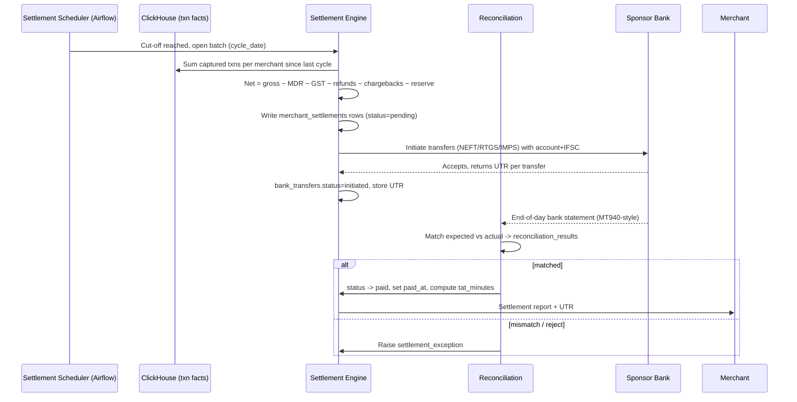

# Settlement Flow

> Settlement is how captured transactions become money in the merchant's bank
> account. It runs as a batch cycle (default **T+1**), nets out fees, refunds and
> chargebacks, books a rolling reserve where required, and initiates a bank
> transfer that must later reconcile to the rupee.

---

## 1. The settlement clock

A transaction captured today settles on a future date determined by the
merchant's `settlement_cycle`:

| Cycle | Meaning | Used for |
|---|---|---|
| `T+0` | Same-day (instant). Premium, fee-bearing. | High-trust, high-volume merchants |
| `T+1` | Next working day. **Default.** | Most merchants |
| `T+2` | Two working days. | New / higher-risk merchants, credit/EMI |

"Working day" matters: a Friday capture on T+1 lands Monday (bank holidays push
it further). The cycle is configured in
`merchant.merchant_settlement_configuration` and a settlement window time
(`settlement_window`, default 23:00) decides the daily cut-off.

---

## 2. End-to-end flow



---

## 3. The settlement math

For each merchant in a batch (`settlement.merchant_settlements`):

```
gross_amount       = Σ captured txn amounts in the cycle
mdr_amount         = Σ per-txn MDR (from txn.transaction_fees)
gst_amount         = Σ per-txn GST on fees
refund_amount      = Σ refunds processed in the cycle (debit)
chargeback_amount  = Σ chargebacks debited in the cycle
rolling_reserve    = reserve_pct × gross   (held back, released later)
adjustments        = manual corrections / reserve releases / penalties
─────────────────────────────────────────────────────────────────────
net_amount = gross − mdr − gst − refund − chargeback − reserve + adjustments
```

- **Rolling reserve** (`merchant_settlement_configuration.rolling_reserve_pct`)
  is a risk tool: hold back e.g. 5% for 90 days to cover future chargebacks on
  high-risk merchants. Released later via `settlement_adjustments`.
- **Negative net** (refunds/chargebacks exceed sales) carries forward as a debt
  or is recovered from the reserve — modeled as a `settlement_exception`.

---

## 4. Batch and transfer tables

| Concern | Table |
|---|---|
| One row per cycle run | `settlement.settlement_batches` |
| Per-merchant netting | `settlement.merchant_settlements` |
| Reserve release / penalties / corrections | `settlement.settlement_adjustments` |
| The actual bank payout (UTR, mode, status) | `settlement.bank_transfers` |
| Expected-vs-actual match | `settlement.reconciliation_results` |
| Failures (bank reject, mismatch, hold) | `settlement.settlement_exceptions` |

Transfer **mode** is chosen by amount and urgency: IMPS (instant, ≤₹5L), NEFT
(batched), RTGS (≥₹2L, real-time gross). The bank returns a **UTR** (Unique
Transaction Reference) per payout — the merchant's proof of receipt and the key
reconciliation joins on.

---

## 5. Reconciliation

Reconciliation is non-negotiable in payments: every rupee we say we paid must
match the bank's statement. `reconciliation_results` stores `expected_amount`
vs `actual_amount` with a generated `variance` column and a `matched` flag.
Unmatched rows become `settlement_exceptions` for the finance ops team. Common
breaks:

- Bank rejected the transfer (bad IFSC, account frozen) → retry to a corrected
  account.
- Partial credit / fee deducted by intermediary bank → variance investigation.
- Timing: payout initiated but not yet reflected → resolves next statement.

---

## 6. Metrics (Settlement dashboard)

These come from `payments.fact_settlements` and the `mv_settlement_perf`
materialized view:

| Metric | Definition |
|---|---|
| **Settlement TAT** | `tat_minutes` — minutes from cycle close to `paid_at`. |
| **Failed settlements** | count where `status = 'failed'`. |
| **Settlement volume** | Σ `net_amount` where `status = 'paid'`. |
| **On-hold value** | Σ `net_amount` where `hold_payouts` or exception open. |
| **Reconciliation match rate** | matched / total batches. |

> The legacy pain this platform fixes: settlement monitoring used to be a
> next-morning spreadsheet. Here, `fact_settlements` streams in via the
> `settlement_events` Kafka topic and the dashboard shows TAT and failures live.
