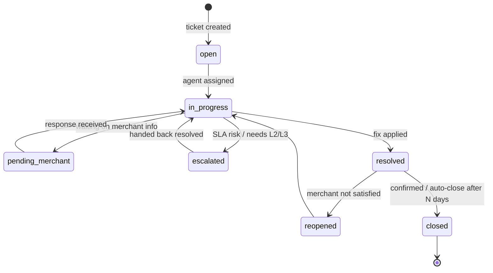
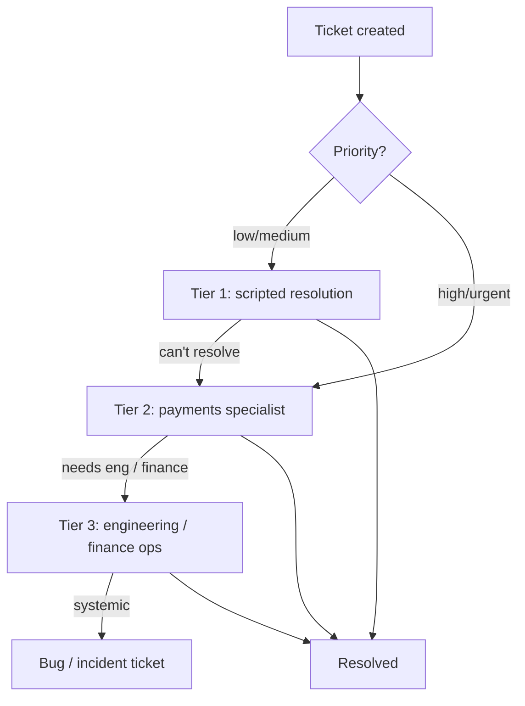

# Support Flow

> Support is where merchant trust is won or lost. In payments the tickets are
> rarely "how do I reset my password" — they're "where is my settlement" and
> "this charge is disputed". This document covers the ticket lifecycle, SLA
> mechanics, escalation, and how support ties back to the settlement, refund and
> fraud domains.

---

## 1. What merchants actually contact us about

Support volume in a payments business clusters into a handful of categories
(`support.support_tickets.category`), most of which are downstream of another
lifecycle:

| Category | Typical issue | Links to |
|---|---|---|
| `settlement` | "My T+1 payout didn't arrive." | `settlement.merchant_settlements`, `bank_transfers` |
| `txn_dispute` | "Customer says they were charged twice." | `txn.transaction_header`, `refund` |
| `device` | "Soundbox not announcing / POS offline." | `device.device_health` |
| `kyc` | "Re-verification / document rejected." | `merchant.merchant_kyc` |
| `refund` | "Refund initiated but customer hasn't received it." | `refund.refund_transactions` |
| `pricing` | "MDR looks wrong on my statement." | `merchant.merchant_pricing` |

> This is why the support schema FKs into both `merchant_master` and
> `customer_master`: tickets are mostly raised by merchants, occasionally by
> end-customers, and almost always reference a transaction or settlement.

---

## 2. Ticket lifecycle

`support.support_tickets.status` with transitions recorded in
`support.ticket_status_history`:

---

## 3. Support tiers and escalation

Escalations are tracked in `support.ticket_escalations` with a `level` and
`escalated_to`. A settlement dispute that turns out to be a bank-reject, for
instance, escalates from Tier 1 → Tier 3 (finance ops) and links to a
`settlement.settlement_exceptions` row.

---

## 4. SLA mechanics

SLA is the contractual promise (`support.sla_tracking`), set by priority:

| Priority | First-response target | Resolution target |
|---|---|---|
| `urgent` | 15 min | 4 h |
| `high` | 1 h | 8 h |
| `medium` | 4 h | 24 h |
| `low` | 8 h | 72 h |

`sla_tracking` stores `first_response_at`, `resolution_due_at`, and a `breached`
flag. The clock typically **pauses** while in `pending_merchant` (waiting on the
merchant) and resumes on their reply — important so we don't penalize agents for
merchant delays.

---

## 5. Complaints vs tickets

A **complaint** is a formal grievance that may have regulatory weight (RBI's
ombudsman framework for payment systems). `support.merchant_complaints` and
`support.customer_complaints` reference the originating ticket but are tracked
separately because they carry different reporting and resolution-time
obligations than a routine ticket.

---

## 6. Metrics (Customer Support dashboard)

Sourced from `payments.fact_support_events` (streamed via the `support_events`
Kafka topic):

| Metric | Definition |
|---|---|
| **Ticket volume** | tickets created per day, by category |
| **SLA compliance** | tickets resolved within target / total |
| **First-response time** | created → `first_response_at` |
| **Resolution time** | created → `resolved_at` (`resolution_mins`) |
| **Escalation rate** | escalated tickets / total |
| **Reopen rate** | reopened / resolved |
| **Backlog** | open + in_progress at end of day |

A spike in `settlement` tickets is an early warning that a settlement batch
failed — the support dashboard and the settlement dashboard are read together
during incidents.
